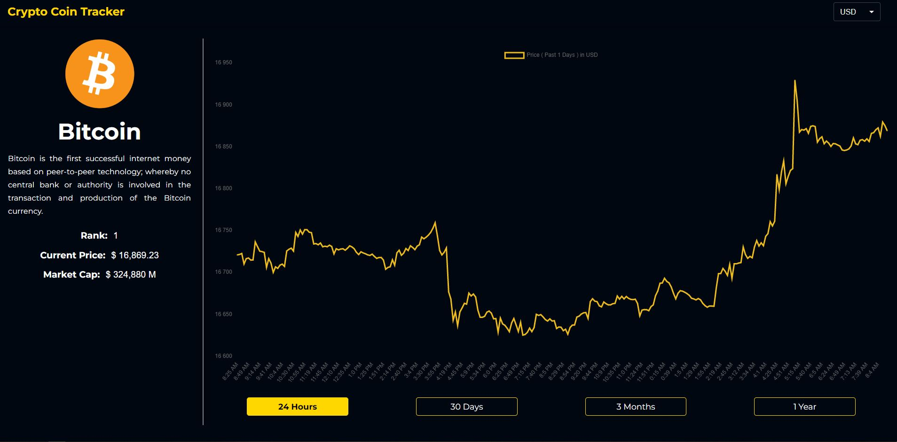

# cryptocurrency-tracker
 Cryptocurrency tracker with React 
 
## 💡 Concept
This web app is made with React, Material UI and CSS modules along with some other libraries. Data is taken from Coingecko API.
The Crypto Coin Tracker will be developed further to add more general market statistics and more individual coin statisticks.

 
## 🔍 Project overview 
Cryptocurrency Tracker is based on Coingecko API to track current prices of the most important cryptocurrencies. On homepage there is a list of currencies sorted descending, a slider with the trading cryptos and a possibility to choose real currency (right now USD or PLN). Each cryptocurrency has it's detail page with a chart (various timespans) and some detail financial info.

## 📦 Tech stack:
- React.js with Hooks
- CSS modules
- Context API
- Material UI
- Chart.js
- Alice Carousel
- Coingecko API

## 💻 Demo
Click the link and check the app: [Link](https://ms-crypto-coin-tracker.netlify.app/)

### Screenshot

## 💾 Installation
git clone https://github.com/marcinsuski/cryptocurrency-tracker.git
npm install
npm start

## ☎️ Contact
In case of any comments or advice, You can e-mail me or use Issues :)

## 🧙‍♂️ Author
- GitHub - [Marcin Suski](https://github.com/marcinsuski)
- LinkedIn - [marcin-suski](https://www.linkedin.com/in/marcin-suski/)
- Porftolio - [marcinsuski.pl](https://marcinsuski.pl)
